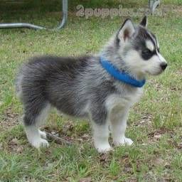

<!DOCTYPE html>
<html lang="en">

<head>
    <meta charset="UTF-8">
    <meta name="viewport" content="width=device-width, initial-scale=1.0">
    <meta http-equiv="X-UA-Compatible" content="ie=edge">
    <link rel="stylesheet" href="style.css">
    <title>Document</title>
</head>

<body>

        <header>
        
                <h1> The Coll Quiz </h1>
                
                    
        
        </header>
    
        <main>

            <section id="aboutMe">

                
 I am from California and enjoy warm weather and the sun. I also love rain too as I now live in Oregon. Hiking with my dogs is one of my favorite past times as well as playing games like Magic The Gathering. I play guitar but do not abide by a playing style, I enjoy a free style approach. My hopes and dreams are to begin a coding career with the help of my handy computer.
                

            </section>
        
            <section id="instructions">
    
                
 Now that you know a little about me, are you ready to take my quiz?
                

    
                    <button id="beginButton">Start The Quiz</button>
            
            </section>
    
            <section id="resultsPage">
            
                

                

    
                 
                     
                
 
                

    
            </section>
            
    
</body>

</html>
